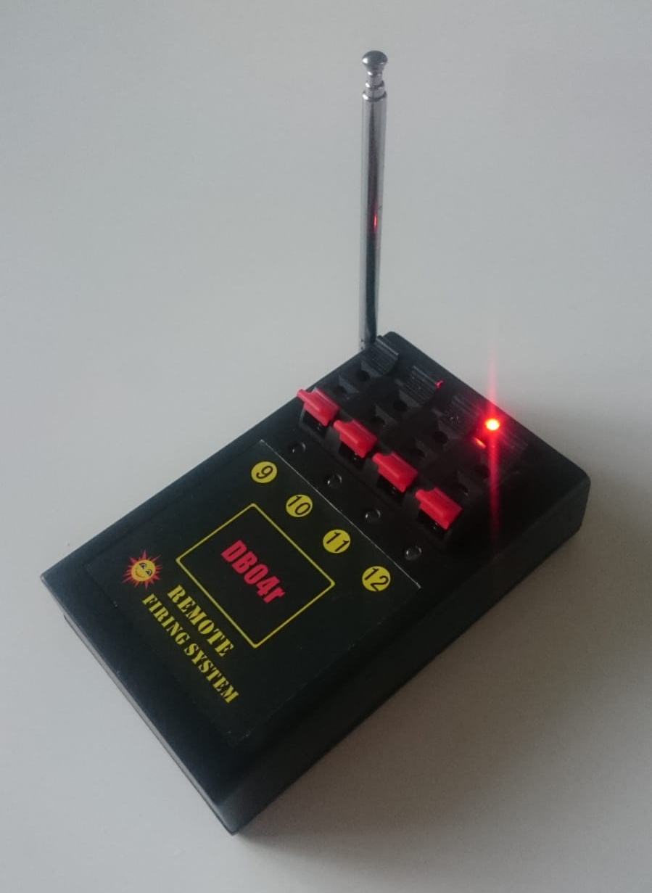

# Pyro Player

Pyro Player is a quick'n'dirty piece of software to control a simple pyromusical
this December 🎆 😄

## Concept

We use the DB04r firework firing system / receiver that gets its commands over
433Mhz. We send commands to it through a Raspberry Pi, that we then in turn
control through WebSockets over WiFi. Assuming that there is no WiFi present
where you wish to run your pyromusical, we set up the Raspberry Pi to act as an
access point. Because the sound card of the Pi is pretty crappy, we play the
music on the client device (your phone or laptop).



## Stuff that you need

* Raspberry Pi
* 433Mhz transmitter board like the FS1000A
* (A couple of) DB04r receiver(s)
* WiFi client device (your phone or laptop, for example)
* Nice set of (wired) speakers
* Fireworks!

## Preparation

### Hardware / software

Warning: This is a work in progress. Instructions may be wrong and the software
isn't done yet.

* Attach the transmitter to your Raspberry Pi ([as shown here](https://www.youtube.com/watch?v=Xe5Bj_N4Crw))
* Install Raspbian on the Raspberry Pi
* Configure the Pi as a WiFi access point ([as detailed here](https://www.raspberrypi.org/documentation/configuration/wireless/access-point.md))
* In a terminal, run:

```bash
/home/pi $ apt-get install git node
/home/pi $ git clone git@github.com:Timendus/pyro-player.git
/home/pi $ cd pyro-player
/home/pi/pyro-player $ npm install
/home/pi/pyro-player $ npm run install-service # TODO
```

* Reboot the Raspberry Pi

### Content

* Using an editor of your choice, create a `.srt` subtitle file for your music(video) with commands instead of subtitles
* Those commands correspond to the queues on your firework receivers, available commands [listed here](https://github.com/Timendus/pyro-player/blob/master/shared/commands.js)
* Get your music file and your `.srt` file ready

### Fireworks

* Connect the right fireworks to the right queues on the igniter
* Put them in the right spots and all that, in range of the Pi's transmitter

## Execution

* Power up the Raspberry Pi, wait for it to boot (tip: use a USB power bank)
* Connect your WiFi client device to a nice set of (wired) speakers. Don't use Bluetooth because it introduces a delay
* On your client device:
  * Connect to the Raspberry Pi's WiFi
  * Open a web browser and navigate to `http://192.168.4.1` (or whatever the IP address of the Pi is)
  * Upload your music file and your `.srt` file
  * Press play

The right queues should be lit at the right times, firing the fireworks in sync
with your music.

Magic 🎆

## Easter eggs of the DB04r

Our set is supposed to go up to 12 queues, corresponding with the 12 buttons on the remote. However, it turns out we can program the receivers with higher numbers too. Put the receiver in programming mode and send the first number of the set of four that you want the receiver to respond to. So if you want it to respond to 17, 18, 19 and 20, you have to send it 17. You can use the Pyro Player for that, with a random music file and a `.srt` file that reads:

```srt
1
00:00:00,000 ---> 00:00:00,000
fire 17
```

Another Easter egg that we discovered is that some codes trigger "special behaviour" in the receivers. For example, if you send the code 13, all the numbers from 1 through 12 will fire at once. If you send the code 15, they will all fire in sequence, one after the other. And this goes for the higher numbers too, so sending the code 29 will trigger all of the queues 17 to 28 to fire at once.

Because of this behaviour, there is no command `fire 13`, but instead there is a command `fire 1 through 12 now`. See our [list of commands](https://github.com/Timendus/pyro-player/blob/master/shared/commands.js), where we have tried to document the magic codes.
